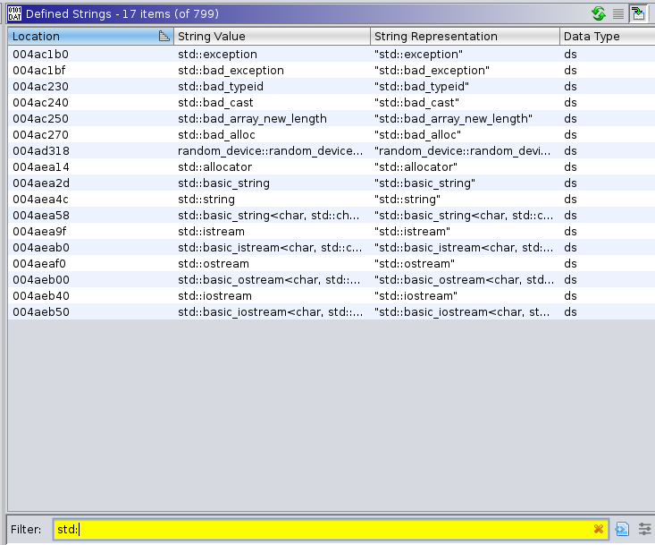
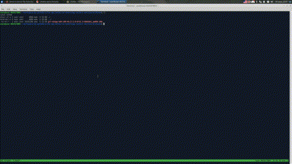
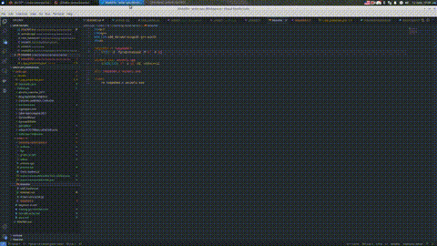
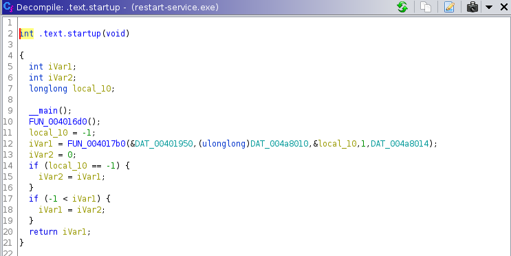

# Ghidra Show Case - Reversing `restart-service.exe`

This PE file is found on a HTB machine. A friend of mine gave it to me because he was stuck on it. Later he uncovered a hidden password used for a login but he found it by using dynamic utility for Windows API tracing. I'm determined to solve this challenge with no dynamic tools only with Ghidra.

So lets start ..

## Initial Analysis

First thing that is noticed is the wrong default Compiler ID guessed by Ghidra so we need to fix it:

**WARNING:** Not quite a fix yet - [MinGW analysis identifies incorrect calling conventions and demanging analyzer partially fails](https://github.com/NationalSecurityAgency/ghidra/issues/2208). Unfortunatelly when choosing `gcc` as a Compiler ID the calling conventions of the executable are messed up (uses `__stdcall` instead of the right `__fastcall`). When you let the `windows` Compiler ID - the C++ symbol names are not demangled.

The executable obviously uses C++ and the C++ `std` library. There are string artefacts in support in this:

This is perfect opportunity for Ghidra's FID plugin. Based on the `GCC: (GNU) 8.3-win32 20190406` the exact version of Mingw-w64 toolchain and `libstdc++` library can be pinpointed to [g++-mingw-w64-x86-64](https://packages.debian.org/buster/g++-mingw-w64-x86-64). Lets extract `libstdc++-6.dll`:

Minding the **WARNING** the plan is:

1. Import and analyze `libstdc++-6.dll` with `gcc` Compiler ID - the `__stdcall` is the right one for `.dll` files.
1. Leave `restart-service.exe` with the `windows` Compiler ID.
1. Create and populate a `.fiddb` from `libstdc++` with Compiler ID in Language set to `windows`
1. Apply this `.fiddb` to `restart-service.exe`

**TO-DO:** ..

## Finding `main()`

So we know `mingw-w64` is used. In `$GHIDRA_HOME/docs/GhidraClass/Advanced/Examples/` there is a example file - `animals.cpp`. A very simple C++ program with simple object initialization. The idea is to compile this file with `mingw-w64` and let `g++`'s symbols in and then analyse it with Ghidra. We find that `main()` is actually named `.text.startup`:

Finally we are at the gates of the challenge:

**TO-FIX:** Mind `gcc` bug and re-record the video

## `main()` - Initial Analysis

**TO-DO: ..**
