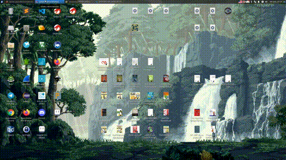
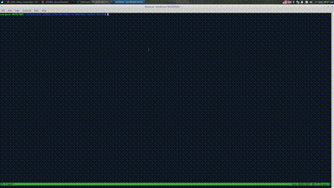
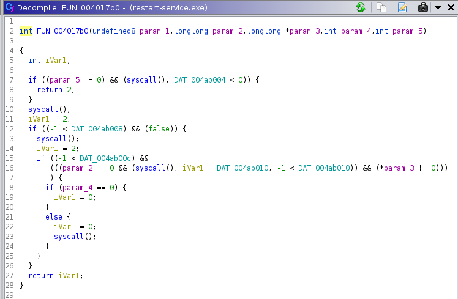
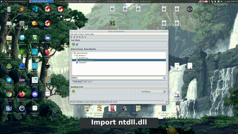
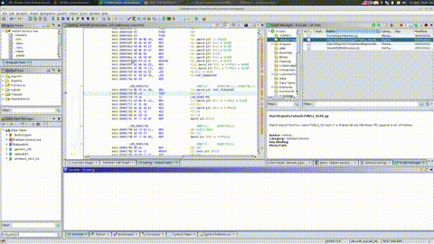
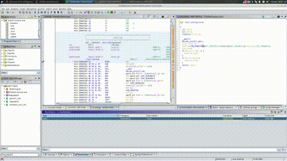

# Ghidra Show Case - Reversing `restart-service.exe`

This PE file is found on a HTB machine. A friend of mine gave it to me because he was stuck on it. Later he uncovered a hidden password used for a login but he found it by using dynamic utility for Windows API tracing. I'm determined to solve this challenge with no dynamic tools only with Ghidra.

So lets start ..

## Initial Analysis

First thing that is noticed is the wrong default Compiler ID guessed by Ghidra so we need to fix it:

[](https://vimeo.com/559584993)

**WARNING:** Not quite a fix yet - [MinGW analysis identifies incorrect calling conventions and demanging analyzer partially fails](https://github.com/NationalSecurityAgency/ghidra/issues/2208). Unfortunatelly when choosing `gcc` as a Compiler ID the calling conventions of the executable are messed up (uses `__stdcall` instead of the right `__fastcall`). When you let the `windows` Compiler ID - the C++ symbol names are not demangled.

The executable obviously uses C++ and the C++ `std` library. There are string artefacts in support in this:


This is perfect opportunity for Ghidra's FID plugin. Based on the `GCC: (GNU) 8.3-win32 20190406` the exact version of Mingw-w64 toolchain and `libstdc++` library can be pinpointed to [g++-mingw-w64-x86-64](https://packages.debian.org/buster/g++-mingw-w64-x86-64). Lets extract `libstdc++-6.dll`:

[](https://vimeo.com/560524519)

Minding the **WARNING** the plan is:

1. Import and analyze `libstdc++-6.dll` with `gcc` Compiler ID - the `__stdcall` is the right one for `.dll` files.
1. Leave `restart-service.exe` with the `windows` Compiler ID.
1. Create and populate a `.fiddb` from `libstdc++` with Compiler ID in Language set to `windows`
1. Apply this `.fiddb` to `restart-service.exe`

[](https://vimeo.com/560968132)

Now we can separate partially the boilerplate code and we can easier locate `main()`.

## Finding `main()`

So we know `mingw-w64` is used. In `$GHIDRA_HOME/docs/GhidraClass/Advanced/Examples/` there is a example file - `animals.cpp`. A very simple C++ program with simple object initialization. The idea is to compile this file with `mingw-w64` and let `g++`'s symbols in and then analyse it with Ghidra. We find that `main()` is actually named `.text.startup`:

[](https://vimeo.com/561694968)

Finally we are at the gates of the challenge:


## `main()` - Initial Analysis

Two function calls are observed:

```c
...
FUN_004016d0();
...
iVar1 = FUN_004017b0(&DAT_00401950,(ulonglong)DAT_004a8010,&local_10,1,DAT_004a8014);
...
```

`FUN_004016d0` makes some strange reading from GS register -`GS:[0x30]` which in Windows is [Thread Information Block](https://en.wikipedia.org/wiki/Win32_Thread_Information_Block), reads values from memory (`_sysc:004ab004 7e aa 44 39  undefined4 3944AA7Eh`) , makes calculations with it and than write back to the same global variables.

Lets see `FUN_004017b0`:



`syscall()` indicates direct usage of `SYSCALL` instruction. Knowing that the `RAX/EAX` register contains the syscall ID and recognizing the same global variables used in the previous function are loaded in `EAX`:

```
...
.text:004017f9 8b 05 09 98  MOV  EAX,dword ptr [DAT_004ab008]
...
.text:00401827 0f 05  SYSCALL
...
```

we can assume that `FUN_004016d0` decodes the syscall IDs that are used in `FUN_004017b0`. Lets rename `FUN_004016d0` to `decode_syscall_ids`.

## Analysis of `decode_syscall_ids`

In order to grasp the insane pointer dereferences at:

```c
  lVar2 = *(longlong *)
           (**(longlong **)
              (*(longlong *)(*(longlong *)(*(longlong *)(in_GS_OFFSET + 0x30) + 0x60) + 0x18) + 0x10
              ) + 0x30);
```

and using the following resources:

- [BytePointer:tebpeb64](http://bytepointer.com/resources/tebpeb64.htm)
- [GeoffChappell:PEB](https://www.geoffchappell.com/studies/windows/km/ntoskrnl/inc/api/pebteb/peb/index.htm)
- [Nirsoft:LDR_DATA_TABLE](http://www.nirsoft.net/kernel_struct/vista/LDR_DATA_TABLE_ENTRY.html)
- [Undocumented.NTinternals:PEB](http://undocumented.ntinternals.net/index.html?page=UserMode%2FUndocumented%20Functions%2FNT%20Objects%2FProcess%2FPEB.html)
- numerous MSDN searches

I was able to put together [tebpeb64.h](tebpeb64.h) (Most of it is from [BytePointer]((http://bytepointer.com) but some edition was needed). It is time to show some Ghidra kung fu. The plan is the following:

1. Clean the `.h` file using gcc
1. Parse the `.h` with Ghidra and make a Data DB
1. Use the new Data DB to annotate the appropriate structure data types

[](https://vimeo.com/562144909)

So we have the base address where the first DLL is loaded:

```c
  PVar2 = ((((in_GS_OFFSET->TEB->ProcessEnvironmentBlock->Ldr->InLoadOrderModuleList).Flink)->
           InLoadOrderLinks).Flink)->DllBase;

```

Later in this function `DllBase` is used in a bunch of other pointer dereferences.

From [How to find dlls loaded into a process and its location etc](https://stackoverflow.com/questions/3454281/how-to-find-dlls-loaded-into-a-process-and-its-location-etc) and what we know from `FUN_004017b0` the best candidate for `DllBase` is `ntdll.dll`. This makes perfect sense because `ntdll.dll` is the only place in Windows API where the `SYSCALL` instruction is used.

For figuring out what the rest of the code is doing we'll take different approach. Beaceuse every operation and dereference is done on another program the easiest way is to implement a simple script and apply it to analyzed `ntdll.dll` program in Ghidra.

### Scripting in `ntdll.dll`

First a working `ntdll.dll` is needed. Because I know that the target is taken from Windows 10 I can use newer `ntdll.dll` from [WikiDll](https://wikidll.com/microsoft/ntdll-dll)

I have crafted a simple Ghidra script written in Jython to show what the following lines are refering to ([ShowNtdllAddresses.py](ghidra_scripts/ShowNtdllAddresses.py)):

```c
...
  uVar8 = (ulonglong)*(uint *)(PVar2 + 0x88 + (longlong)*(int *)(PVar2 + 0x3c));
  uVar9 = (ulonglong)*(uint *)(PVar2 + 0x18 + uVar8);
...
        pcVar7 = (char *)((ulonglong)*(uint *)(*(uint *)(PVar2 + 0x20 + uVar8) + PVar2 + uVar9 * 4)
                         + PVar2 + 2);

```

[](https://vimeo.com/562182504)

So what happens is that all the exported function names are iterated. The first two characters are discarded (` + 2);`). On the rest of the string is applied a hash calculation:

```c
        uVar3 = 0x811c9dc5;
        do {
          uVar6 = uVar3;
          cVar1 = *pcVar7;
          pcVar7 = pcVar7 + 1;
          uVar3 = (uVar6 ^ (int)cVar1) * 0x1000193;
        } while (cVar1 != '\0');
```

From the constants `0x811c9dc5` and `0x1000193` we find that this is [fnv1a_32](https://en.wikipedia.org/wiki/Fowler%E2%80%93Noll%E2%80%93Vo_hash_function) implementation. The next video shows the execution of a script that emulates what the `decode_syscall_ids` does ([MatchExportsToHash-FVN1a_32-PE.py](ghidra_scripts/MatchExportsToHash-FVN1a_32-PE.py) and [MatchExportsToHashAndReplaceWithSyscall-FVN1a_32-PE.py](ghidra_scripts/MatchExportsToHashAndReplaceWithSyscall-FVN1a_32-PE.py)):

[](https://vimeo.com/562186810)

Now we have all the `SYSCALL` IDs decoded. We can move to the next function.

## Analyzing `FUN_004017b0`

In order to make decompilation prettier I'm going to use the trick with the overlay memory section. The plan is the following:

1. Create a new memory section of type `OTHER` with `overlay` option set
1. Create a function at each syscall ID as address in that region with propper name and calling convention
1. At each `SYSCALL` instruction add reference of type `CALLOTHER_OVERRIDE_CALL` to the propper location at the `OTHER` section

Because there is no `syscall` convention when we are dealing with `windows` compiler ID we will create it by implementing a custom calling convention. This type of work is worth scripting it but because we are dealing with 5 syscalls it is not worth the effort. However there is a script that does the thing which may be edited to fit your purpose - search for `ResolveX86orX64LinuxSyscalsScript.java`.

**NOTE**: `syscall` calling convention which is in effect when dealing with Windows syscalls has the following parameter order set in registers: `RDI`, `RSI`, `RDX`, `R10`, `R8`, `R9`

[](https://vimeo.com/562369992)

Now we can rename `FUN_004017b0` to `exec_payload`.

## Shellcode Analysis and Patching

The first part is:

```
.text:00401950 eb 00           JMP                 LAB_00401952
              LAB_00401952                               XREF[1]:     00401950(j)  
.text:00401952 e8 6a 6c 00     CALL                SUB_004085c1
```

which fills the `RSP` with the address after `CALL SUB_004085c1`. Next we have:

```
              **************************************************************
              *                         SUBROUTINE                         *
              **************************************************************
              SUB_004085c1                               XREF[1]:     00401952(c)  
.text:004085c1 41 5e           POP                 R14
.text:004085c3 f5              CMC
.text:004085c4 eb 00           JMP                 LAB_004085c6
              LAB_004085c6                               XREF[1]:     004085c4(j)  
.text:004085c6 41 f7 16        NOT                 dword ptr [R14]
.text:004085c9 eb 00           JMP                 LAB_004085cb
              LAB_004085cb                               XREF[1]:     004085c9(j)  
.text:004085cb 41 81 6e 04     SUB                 dword ptr [R14 + 0x4],0xd7e3a9db
.text:004085d3 41 c1 4e 08     ROR                 dword ptr [R14 + 0x8],0x2b
.text:004085d8 eb 00           JMP                 LAB_004085da
              LAB_004085da                               XREF[1]:     004085d8(j)  
.text:004085da 41 81 46 0c     ADD                 dword ptr [R14 + 0xc],0xfaf545c1
.text:004085e2 41 ff e6        JMP                 R14
```

so `POP R14` loads the address after `CALL SUB_004085c1` and makes a few code patches before returning execution there. Easiest thing to do is to do this patch by a script.